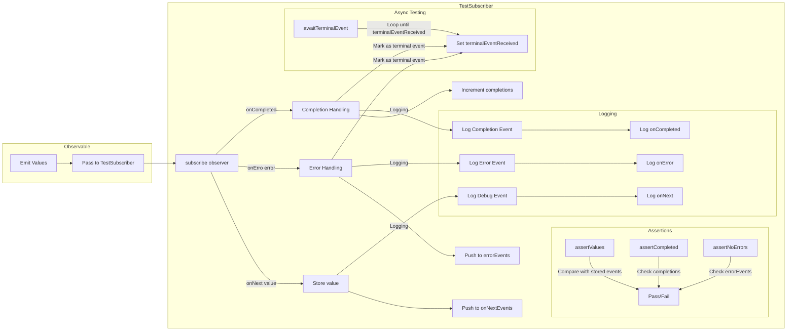
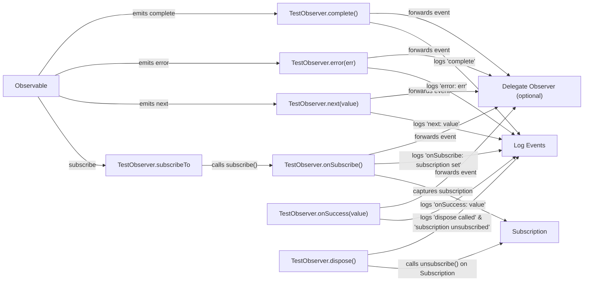

# RxJS-TestSubscriber

RxJS-TestSubscriber is a **powerful RxJS testing utility** designed to make **observables testing easier and more structured**. It provides **assertions, logging, and debugging capabilities**, making it simple to validate **RxJS streams**.

🚀 **Features**

- **Unit test RxJS streams** with powerful assertion methods.
- **Configurable logging** (`DEBUG`, `INFO`, `ERROR`, `NONE`).
- **Delegation support** (wraps another observer/subscriber).
- **Async test support** with `awaitTerminalEvent()`.
- **Fully TypeScript-ready**.

## 🌊 **TestSubscriber&lt;T&gt; Workflow**

---

## **📌 Explanation of the Diagram**$

| **Component** | **Description** |
|--------------|----------------|
| 🟢 `onNext(value)` | Stores emitted values in `onNextEvents`. |
| 🔴 `onError(error)` | Logs and stores errors in `errorEvents`. |
| 🟡 `onCompleted()` | Marks the observable as completed and increments completion count. |
| ✅ `Assertions` | `assertValues`, `assertCompleted`, and `assertNoErrors` verify expected behavior. |
| 🔍 `Logging` | Logs each event (`onNext`, `onError`, `onCompleted`) based on logging level. |
| ⏳ `awaitTerminalEvent()` | Waits until the observable completes or errors out. |

---

## Rxjs TestObserver

